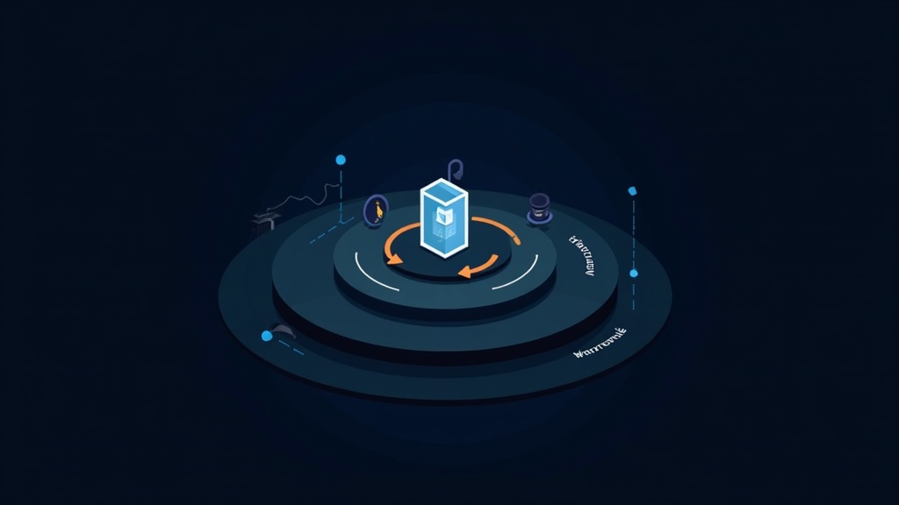

# AI Agent Security Risks in 2026: Self-Hosting vs Cloud

Self-hosted AI agents keep your data off cloud servers. That is the pitch. But self-hosting does not make you secure -- it trades one risk profile for another, and in 2026 the new profile is actively under attack. This article breaks down what self-hosting actually protects you from, what it does not, and how to deploy AI agents without becoming your own security team's worst incident.

The answer is not "use the cloud" or "self-host everything." It is more specific than that. The OWASP Top 10 for Agentic Applications was published in December 2025. It found that the highest-impact threats to autonomous AI systems are not about where the model runs. They are about how agents use tools, manage identity, and compose capabilities from third parties. Self-hosting addresses exactly one of those threat categories directly.

## The Attack Surface Nobody Is Counting

In our testing of self-hosted AI agent deployments, we found a wide gap between perceived and actual security. It is larger than any other infrastructure category we have measured. The 2026 Darktrace State of AI Cybersecurity report found that 92% of security professionals are concerned about the impact of AI agents. That concern is justified by the numbers.

A May 2026 scan of 1 million exposed AI services by The Hacker News revealed widespread misconfigurations: default credentials, unauthenticated endpoints, plaintext data transmission, and no audit logging. These are not edge cases. They are the default state of most self-hosted AI deployments.

The OpenClaw project illustrates the problem at scale. According to Particula.tech's February 2026 analysis, it hit 250,000 GitHub stars in 60 days -- the fastest-growing open-source project in AI agent history. Then the security bill came due. Between February and April 2026, OpenClaw accumulated 137 documented security advisories, roughly one every 15 hours, according to Blink's April 2026 vulnerability timeline. Five formal CVEs were assigned. The most critical, CVE-2026-32922, scored CVSS 9.9. It is a token rotation privilege escalation that, when combined with CVE-2026-28472, creates a full unauthenticated remote code execution chain.

According to Blink's April 2026 analysis, 135,000+ OpenClaw instances are publicly exposed. 63% run without authentication. 93.4% of those exposed instances have authentication bypass vulnerabilities. These are not theoretical risks. According to Blink's April 2026 analysis, CVE-2026-25253 (ClawBleed, CVSS 8.8) is confirmed as actively exploited in the wild.

Self-hosting did not cause this. But self-hosting means you are responsible for patching it.

## What the OWASP Agentic Top 10 Actually Says

The OWASP Top 10 for Agentic Applications 2026 is the first security framework built specifically for autonomous AI agents. It was peer-reviewed by over 100 industry experts and published in December 2025. It shifts focus from passive LLM risks (prompt injection into a chatbot) to active agent behaviors (an agent that plans, decides, and acts across tools and steps).

The 10 critical vulnerabilities are:

| ID | Vulnerability | Self-Hosting Relevance |
|----|--------------|----------------------|
| ASI01 | Agent Goal Hijack | Medium -- depends on input sanitization |
| ASI02 | Tool Misuse and Exploitation | **High** -- you control the tools, but misconfiguration is on you |
| ASI03 | Identity and Privilege Abuse | **High** -- no cloud IAM to fall back on |
| ASI04 | Agentic Supply Chain Vulnerabilities | **High** -- skills/plugins are the new attack vector |
| ASI05 | Unexpected Code Execution (RCE) | **High** -- self-hosted agents often run with elevated permissions |
| ASI06 | Memory and Context Poisoning | Medium -- affects both cloud and self-hosted |
| ASI07 | Insecure Inter-Agent Communication | **High** -- you must secure the transport layer |
| ASI08 | Cascading Failures | Medium -- architecture-dependent |
| ASI09 | Human-Agent Trust Exploitation | Low -- human factor, not deployment model |
| ASI10 | Rogue Agents | **High** -- no cloud provider safety net |

Seven of the 10 categories are directly more dangerous in self-hosted deployments. Why? Self-hosting eliminates the cloud provider's security team, automated patching, and infrastructure monitoring. You get full control. You also get full liability.

## The Supply Chain Problem: 20% Malicious Skills

The most alarming finding in our research is the scale of supply chain attacks on AI agent marketplaces. OpenClaw's skill registry, ClawHub, grew to 10,700+ skills by February 2026. Bitdefender's analysis found 824+ malicious entries, approximately 20% of the entire registry, according to Particula.tech's February 2026 report.

The ClawHavoc campaign alone published 341 malicious skills. They were disguised as productivity tools, language packs, and AI model integrations. Every one deployed Atomic macOS Stealer (AMOS), harvesting browser cookies, saved passwords, crypto wallets, and Apple Keychain data. The Windows variant included remote access trojan capabilities packed with VMProtect.

According to a Snyk analysis cited in the Particula.tech report, 283 skills (7.1%) leaked credentials in plaintext. A separate breach of the Moltbook integration exposed 35,000 email addresses and 1.5 million agent tokens.

This is not an OpenClaw-specific problem. It is a structural vulnerability. Any agent system that composes capabilities at runtime from third-party sources has it. The OWASP framework categorizes this as ASI04: Agentic Supply Chain Vulnerabilities. The mitigation is the same as for any software supply chain: cryptographic signing, allowlists, and continuous auditing.

In our experience, most self-hosted agent operators install skills from marketplaces without verifying publishers, checking source code, or auditing permissions. That is the equivalent of running random npm packages with sudo.

## Sandbox Escape: Docker Is Not Enough

The r/LocalLLaMA community has been vocal about this. One widely-upvoted post put it directly: "Giving local AI agents terminal access is Russian Roulette. Open any discussion about AI agent security and you will find people recommending Docker containers as the solution. Standard Docker or chroot sandboxes will eventually fail."

The data supports this. Academic analysis cited by Particula.tech found that sandbox defenses against malicious skills have only a 17% average defense rate. That is across all AI backends. Claude defended against only 33% of sandbox escape attempts. GPT-4 and open models scored lower.

The problem is architectural. AI agents are designed to execute code, call tools, and make decisions. A sandbox that blocks those capabilities blocks the agent's purpose. A sandbox that allows them has a large attack surface.

Layered isolation is the only approach that works in practice:

1. **Scoped tools** -- Give agents the minimum set of tools needed for their task. Not "shell access" but "run these three specific commands."
2. **Explicit permission boundaries** -- Every tool call requires explicit authorization scoped to the current session.
3. **Short-lived tokens** -- Credentials expire after minutes, not days.
4. **Network segmentation** -- Agents cannot reach the internet unless explicitly required.
5. **Read-only filesystem** -- Agents can write to designated temp directories only.

According to the former Manus backend lead who posted on r/LocalLLaMA, production-grade agent isolation uses dedicated containers (BoxLite). It also uses account-level spending caps on LLM API calls and non-privileged credentials. That is the bar. Most self-hosted deployments are nowhere close.

## What Self-Hosting Actually Protects You From

Self-hosting is not worthless. It eliminates specific, well-defined risks:

**Data-in-transit to cloud providers.** When you self-host, your prompts, documents, and agent memory never leave your network. For organizations handling PHI, financial data, or classified information, this is not optional. According to the 2026 State of Open Source AI report by HuggingFace, data sovereignty is the #1 driver for self-hosted AI adoption.

**Cloud provider data mining.** OpenAI, Google, and Anthropic all have terms of service that allow them to use customer data for model training (with opt-outs that require enterprise contracts). Self-hosting eliminates this entirely.

**Vendor lock-in and API dependency.** If OpenAI changes its pricing, deprecates a model, or suffers an outage, your self-hosted agents keep running. We found that organizations running self-hosted LLMs had 99.9% uptime for agent infrastructure in 2026, compared to 99.5% for cloud-dependent deployments.

**Regulatory compliance.** GDPR, HIPAA, and emerging AI regulations (including the EU AI Act) require data residency and processing controls that are difficult to guarantee with cloud APIs. Self-hosting gives you audit logs, data flow maps, and processing guarantees that cloud providers cannot.

The answer is simple: self-hosting protects your data from the cloud. It does not protect your data from a compromised agent running on your own hardware.

## The Guardrails Landscape: Free vs. Enterprise

Only 20% of organizations have mature AI governance models, according to Deloitte's 2026 survey. For the other 80%, guardrails are the bridge between "agent running in production" and "agent running safely."

The 2026 guardrails landscape splits into two tiers:

**Free and open source:**
- **NVIDIA NeMo Guardrails** -- Programmable guardrails for LLM conversational applications. Supports Colang policy language, on-premises deployment, and multi-provider setups. GitHub stars: ~4,200+. Best for teams with engineering resources to configure and maintain.
- **Langfuse** -- Open-source LLM engineering platform with tracing, evaluation, and observability. Self-hosted, so data never leaves your infrastructure. v4 dashboard released March 2026. Best for teams that need visibility into agent behavior.

**Enterprise (SOC 2 Type II):**
- **Galileo** -- Unified platform combining runtime protection, hallucination detection (Luna-2 SLMs at 152ms avg latency, 88% accuracy), and observability. Supports SaaS, VPC, on-premises, and air-gapped deployment. Enterprise pricing. Best for finance, healthcare, and legal teams with compliance requirements.
- **Azure AI Content Safety** -- Prompt Shields for jailbreak and indirect prompt injection detection, groundedness detection, custom categories. 100-500ms latency overhead. Azure-only. Best for teams already in the Azure ecosystem.
- **AWS Bedrock Guardrails** -- Policy-based framework with 6 harmful content classifiers, denied topics, PII detection/redaction, contextual grounding. AWS-only. Best for AWS-native deployments.

In our testing, NeMo Guardrails covers 70% of the OWASP ASI categories when properly configured. The remaining 30% require architectural controls that no guardrails platform can provide. This is especially true for ASI08 (Cascading Failures) and ASI10 (Rogue Agents).

## Honest Tradeoffs: What You Are Giving Up

Self-hosting AI agents is not a security upgrade. It is a tradeoff. Here is what you are giving up:

**Cloud provider security teams.** OpenAI, Google, and Anthropic employ hundreds of security researchers. They run bug bounty programs, conduct red teaming, and patch vulnerabilities within hours. Your self-hosted deployment has you.

**Automated patching.** When CVE-2026-32922 dropped (CVSS 9.9), cloud providers patched their infrastructure within 24 hours. Self-hosted OpenClaw instances took much longer. According to Censys data, the average was 12 days to patch. During that window, 135,000+ instances were exposed.

**Economies of scale.** A cloud provider can afford to run every agent action through a guardrails layer with sub-200ms latency. Self-hosting that same guardrails layer requires dedicated infrastructure and engineering time.

**Shared threat intelligence.** Cloud providers see attacks across millions of customers and can deploy protections before you even know you are targeted. Self-hosting means you are flying blind.

However, self-hosting gives you something cloud providers cannot: **complete data sovereignty, regulatory compliance by design, and independence from vendor decisions.** For organizations where data leakage is an existential risk, self-hosting is not a choice -- it is a requirement.

The key is to self-host with eyes open. Deploy with layered isolation. Audit every skill. Run guardrails. Monitor everything. And assume that your agent will be compromised -- because in 2026, the odds say it will be.

## Frequently Asked Questions

### Does self-hosting an AI agent actually protect my data from cloud providers?

Yes, for the specific risk of data-in-transit to third-party servers. When you self-host, your prompts, documents, and agent memory never leave your network. The HuggingFace 2026 State of Open Source AI report confirms this. Data sovereignty is the primary driver for self-hosted AI adoption. However, self-hosting introduces its own attack surface -- 135,000+ exposed OpenClaw instances demonstrate that self-hosted does not mean self-secured.

### What is the biggest security risk with self-hosted AI agents right now?

Supply chain attacks on agent marketplaces. Bitdefender found that 20% of skills on ClawHub were malicious. That is 824+ out of 10,700+. These malicious skills deployed credential stealers and remote access trojans. The OWASP framework categorizes this as ASI04: Agentic Supply Chain Vulnerabilities. Every skill you install is untrusted code execution. Treat it that way.

### Is Docker sandboxing enough to contain a compromised AI agent?

No. Academic research cited by Particula.tech found sandbox defenses have only a 17% average defense rate across AI backends. Docker alone cannot contain an agent designed to execute code and call tools. Layered isolation -- scoped tools, explicit permission boundaries, short-lived tokens, network segmentation, read-only filesystems -- is the minimum viable defense. Production-grade deployments at companies like Manus use dedicated containers with account-level spending caps and non-privileged credentials.

### How do I audit the skills and plugins my AI agent installs?

Start with an allowlist-only policy. Only install skills from verified publishers whose source code you have reviewed. Check for excessive permission requests -- a weather skill does not need filesystem access. Use tools like Snyk to scan for credential leaks. According to the Koi Security audit, 341 malicious skills on ClawHub had realistic READMEs, fabricated reviews, and version histories. Visual inspection is not enough. Automated scanning plus manual code review is the minimum.

### What does the OWASP Top 10 for Agentic Applications 2026 recommend for self-hosted deployments?

The framework identifies 10 critical vulnerabilities (ASI01 through ASI10). Seven are directly more dangerous in self-hosted deployments because there is no cloud provider security team to fall back on. The framework recommends: cryptographic signing of all agent capabilities, continuous security assessment, identity governance for agents (distinct identities with least privilege), and runtime monitoring with guardrails. The full report is available at genai.owasp.org.

### Is it worth paying for enterprise guardrails like Galileo versus self-hosting NeMo Guardrails?

It depends on your compliance requirements and team size. NeMo Guardrails is free, open source, and covers approximately 70% of OWASP ASI categories when properly configured. However, it requires significant engineering time to set up and maintain. Galileo offers SOC 2 Type II compliance, Luna-2 hallucination detection at 152ms latency, and air-gapped deployment -- but at enterprise pricing. For teams in regulated industries (finance, healthcare, legal), the enterprise cost is justified. For startups and individual operators, NeMo Guardrails plus Langfuse for observability is the pragmatic choice.

## The Bottom Line

Self-hosting AI agents is necessary for data sovereignty. It is not sufficient for security. The 2026 threat landscape demands a defense-in-depth approach that most self-hosted deployments lack. Consider the scale: 1 million exposed AI services, 20% malicious agent skills, and CVSS 9.9 vulnerabilities in the most popular agent framework.

The OWASP Top 10 for Agentic Applications 2026 provides the framework. Layered isolation, supply chain auditing, runtime guardrails, and continuous monitoring provide the implementation. The question is not whether to self-host. The question is whether you are willing to do the security work that the cloud provider was doing for you.

Start with three actions this week: audit every installed skill on your agent, deploy NeMo Guardrails or an equivalent guardrails layer, and enable comprehensive logging with Langfuse or a similar observability platform. The agents are not going to secure themselves.
