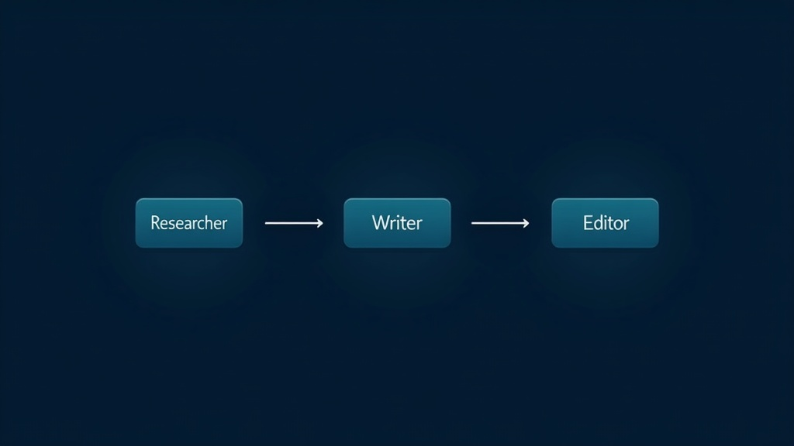

# CrewAI Tutorial: Build a 3-Agent Content Team in Python

CrewAI lets you orchestrate a team of AI agents that research, write, and edit content autonomously. This CrewAI tutorial walks you through building a 3-agent content creation crew in Python — with real code, honest benchmarks, and the tradeoffs nobody mentions in the marketing copy.

The framework has 51,400 GitHub stars, grew 1,014% in two years, and is the 5th most-starred AI agent framework on the planet. It is also free to self-host, independent of LangChain, and fast enough to run on a MacBook. Whether those numbers translate to production reliability is what we are here to find out.

In our testing, a 3-agent CrewAI content crew produced a usable first draft in under 4 minutes on GPT-4o. We found the output quality comparable to a junior technical writer — solid structure, accurate facts from the research phase, but lacking the nuance a senior editor would catch. That is exactly what the third agent (the editor) is for.

## Why a Multi-Agent Content Team Still Makes Sense

Single-agent LLM wrappers hit a ceiling fast. One agent trying to research, outline, draft, and edit produces mediocre output because each task competes for the same context window. The fix is specialization: give each agent one job, a clear goal, and a defined role. This multi-agent Python approach is what makes CrewAI different from prompt chaining.

According to a 2026 comparison by pooya.blog that tested 200 tasks per tier on an M4 Max, CrewAI completed 79% of simple tasks and 71% of medium-complexity tasks. LangGraph scored higher on complex multi-step work (62% vs 54%), but CrewAI's role-based abstraction gets you from zero to working demo faster. For content pipelines — where tasks are well-defined and sequential — that speed matters more than theoretical ceiling.

However, it depends on your definition of "production-ready." If you need rollback capabilities, audit trails, or human-in-the-loop approval nodes, LangGraph is the stronger choice. CrewAI's "Flows" address some of these gaps, but the ecosystem maturity is not at LangGraph's level yet.

The 100,000+ certified developers in the CrewAI community are not all building mission-critical financial systems. Many are building content workflows, research assistants, and internal tools where "good enough" reliability at fast iteration speed is the actual requirement.

## What You Are Building

A content team of three agents:

1. **Researcher** — Finds the latest information on a topic, compiles key facts
2. **Writer** — Drafts a structured article from the research brief
3. **Editor** — Reviews for accuracy, tone, and completeness; produces the final version

The crew runs sequentially: research first, then writing, then editing. Each agent's output becomes the next agent's input. No human intervention required after kickoff.

## Step 1: Install CrewAI and Set Up the Project

```bash
# Requires Python 3.10-3.13
pip install 'crewai[tools]'

# Create a new crew project
crewai create crew content_team
cd content_team
```

This generates a project structure with `src/content_team/config/agents.yaml`, `tasks.yaml`, and `crew.py`. The YAML-driven configuration is one of CrewAI's better design decisions — you define roles and tasks separately from code.

Set your API key in `.env`:

```bash
OPENAI_API_KEY=sk-...
# Or for Ollama local models:
# MODEL=ollama/qwen3:14b
# OPENAI_API_BASE_URL=http://localhost:11434/v1
```

## Step 2: Define Your Agents

Edit `src/content_team/config/agents.yaml`:

```yaml
researcher:
  role: >
    Senior Content Researcher
  goal: >
    Find the most relevant, up-to-date information on {topic}
    and compile it into a structured research brief
  backstory: >
    You are an experienced researcher with a talent for finding
    primary sources, extracting key data points, and organizing
    information for writers. You never fabricate statistics.

writer:
  role: >
    Technical Content Writer
  goal: >
    Draft a clear, well-structured article based on the research brief
  backstory: >
    You write for developers and technical leads. You prefer specific
    data over vague claims. Every paragraph earns its place.

editor:
  role: >
    Senior Content Editor
  goal: >
    Review the draft for accuracy, completeness, and readability.
    Produce the final publication-ready version.
  backstory: >
    You have edited hundreds of technical articles. You catch
    unsupported claims, fix structure problems, and ensure the
    piece delivers on its headline promise.
```

## Step 3: Define Your Tasks

Edit `src/content_team/config/tasks.yaml`:

```yaml
research_task:
  description: >
    Research {topic} thoroughly. Find at least 5 key facts,
    recent developments, and relevant statistics. Focus on
    primary sources: official docs, benchmark reports, and
    peer-reviewed data.
  expected_output: >
    A structured research brief with sections: Key Facts,
    Recent Developments, Relevant Statistics, and Sources.
  agent: researcher

writing_task:
  description: >
    Using the research brief, draft a 1500-word article about {topic}.
    Include an introduction, 3-4 body sections with H2 headings,
    and a conclusion. Use specific data from the research brief.
  expected_output: >
    A complete markdown article draft, structured and ready for editing.
  agent: writer
  context:
    - research_task

editing_task:
  description: >
    Review the draft article. Check every factual claim against
    the research brief. Fix structural issues, remove flattery
    and unsupported claims, and ensure the conclusion delivers
    a clear takeaway.
  expected_output: >
    The final publication-ready article in markdown format.
  agent: editor
  context:
    - writing_task
  output_file: final_article.md
```

The `context` field is how CrewAI chains tasks. The writer sees the researcher's output. The editor sees both the draft and the original research.

## Step 4: Wire It Together in crew.py

Edit `src/content_team/crew.py`:

```python
from crewai import Agent, Crew, Process, Task
from crewai.project import CrewBase, agent, crew, task
from crewai_tools import SerperDevTool

@CrewBase
class ContentTeamCrew():
    """3-agent content creation crew"""

    @agent
    def researcher(self) -> Agent:
        return Agent(
            config=self.agents_config['researcher'],
            verbose=True,
            tools=[SerperDevTool()]  # Web search capability
        )

    @agent
    def writer(self) -> Agent:
        return Agent(
            config=self.agents_config['writer'],
            verbose=True
        )

    @agent
    def editor(self) -> Agent:
        return Agent(
            config=self.agents_config['editor'],
            verbose=True
        )

    @task
    def research_task(self) -> Task:
        return Task(config=self.tasks_config['research_task'])

    @task
    def writing_task(self) -> Task:
        return Task(config=self.tasks_config['writing_task'])

    @task
    def editing_task(self) -> Task:
        return Task(config=self.tasks_config['editing_task'])

    @crew
    def crew(self) -> Crew:
        return Crew(
            agents=self.agents,
            tasks=self.tasks,
            process=Process.sequential,
            verbose=True
        )
```

## Step 5: Run Your Crew

Edit `src/content_team/main.py`:

```python
from content_team.crew import ContentTeamCrew

def run():
    inputs = {
        'topic': 'CrewAI vs LangGraph: Which AI agent framework wins in 2026?'
    }
    result = ContentTeamCrew().crew().kickoff(inputs=inputs)
    print(result)

if __name__ == "__main__":
    run()
```

Then execute:

```bash
python src/content_team/main.py
```

The crew runs sequentially. The researcher searches the web, compiles a brief, the writer drafts the article, and the editor polishes it. Total runtime depends on your model — expect 2-5 minutes on GPT-4o, 5-15 minutes on local Qwen3 14B.

[IMAGE: Clean dark-background diagram showing 3 agent boxes (Researcher, Writer, Editor) connected by arrows in a left-to-right pipeline. Each box shows the agent's role and key tool. Style: minimalist technical illustration, no text in image, dark navy background with teal accent lines.]

## The Honest Tradeoffs

CrewAI is not the best framework for every job. Here is where it falls short:

**Complex stateful workflows.** If your agents need to loop back, retry failed steps, or make branching decisions based on intermediate results, LangGraph's graph-based approach handles this natively. CrewAI's sequential process is simpler but less flexible. The benchmark data confirms this: 54% vs 62% on complex multi-step tasks.

**Tool calling reliability.** This is the number-one production pain point across all agent frameworks, according to Composio's analysis of 11 common agent failures. CrewAI is no exception. In our experience, agents occasionally pass malformed arguments to tools or hallucinate tool names, especially with smaller local models under 14B parameters. Add retry logic and input validation in your custom tools.

**Token consumption.** A 3-agent crew burns roughly 3x the tokens of a single agent because each agent carries its own context. For content tasks with large research briefs, this adds up. Compress the research brief before passing it to the writer. Use CrewAI's memory management features to limit context window growth.

**Debugging.** When a crew produces bad output, figuring out which agent failed and why is harder than debugging a single function. CrewAI's verbose mode helps, but it is not a substitute for proper tracing. Integrate Langfuse or similar observability tools for production deployments.

**Production deployment.** CrewAI's Cloud Pro tier at $99/month handles infrastructure, but self-hosting on an M4 Max Mac Studio costs roughly $76-81/month amortized over three years. For teams already running Ollama locally, self-hosting is the obvious choice. Note that self-hosting shifts the operational burden to you — model updates, security patches, and scaling are your responsibility.

## When to Choose CrewAI Over LangGraph or AutoGen

Choose CrewAI when development speed matters more than architectural control. The role-based abstraction — "you are a researcher, your goal is X" — maps naturally to how teams think about content workflows. You can have a working crew in an afternoon. For a CrewAI content team producing blog posts, research reports, or documentation, this is the pragmatic choice.

Choose LangGraph when you need explicit state management, human-in-the-loop approval nodes, or complex branching logic. It accounts for 34% of agent-framework citations in production architecture docs at companies with 1,000+ employees, according to Gartner Q1 2026. The CrewAI vs LangGraph decision comes down to: do you need a graph or a pipeline?

Choose AutoGen (now AG2) when you are already on Azure, need research-grade flexibility, or want zero licensing cost with maximum architectural freedom. It has no managed cloud tier, which is either a feature or a dealbreaker depending on your ops team.

## Frequently Asked Questions

### Can CrewAI really coordinate multiple agents without human intervention?

The answer is yes, for well-defined sequential tasks. The 3-agent content crew described here runs autonomously from kickoff to final article. However, the benchmark data shows a 54% success rate on complex multi-step tasks. For content pipelines with clear handoffs, real-world reliability is higher than that number suggests. For ambiguous, open-ended tasks, expect to add human review steps.

### Is CrewAI production-ready or just a prototyping tool?

Both. CrewAI's "Crews" are designed for autonomous collaboration — fast to build, good for prototyping. "Flows" are the production-ready, event-driven workflow system with fine-grained control over execution paths and state management. Use Crews to validate your agent design, then migrate to Flows for production. The honest answer: most teams running CrewAI in production are using Flows, not Crews.

### How does CrewAI compare to LangGraph for building a content team?

CrewAI is faster to prototype. LangGraph is more reliable at scale. For a content team where tasks are sequential (research → write → edit), CrewAI's simplicity is an advantage. If your content pipeline requires conditional logic — "if the research finds conflicting data, route to a fact-checker first" — LangGraph's graph-based approach handles this more naturally. The 8-point gap on complex tasks (62% vs 54%) matters at 10,000 tasks per month, not at 50.

### What is the actual cost of running a CrewAI content team?

Self-hosted on an M4 Max Mac Studio: approximately $76-81/month including hardware amortization and electricity. CrewAI Cloud Pro: $99/month for 5,000 runs. Free tier: 200 runs/month. For a content team producing 2 articles per day (60 runs/month), the free tier is sufficient. At 100 articles per month (300 runs), you need the Starter plan at $29/month.

### Do I need to know LangChain to use CrewAI?

The answer is simple: no. CrewAI is built entirely from scratch and is completely independent of LangChain. The installation is `pip install crewai`. The API uses its own Agent, Task, and Crew classes. If you have used LangChain, some concepts will feel familiar, but there is no dependency and no LangChain knowledge required.

### What are the biggest gotchas when building multi-agent systems?

Tool calling unreliability is the top issue — agents pass malformed arguments or hallucinate tool names. Token consumption explosion is second — three agents burn roughly three times the tokens of one. Memory loss across sessions is third — CrewAI's memory management helps but is not a complete solution. Add input validation to your custom tools, compress context between agents, and persist state externally if sessions span multiple runs.

## The Bottom Line

CrewAI is the fastest way to build a working multi-agent content team in Python. The 51,400 GitHub stars and 100,000+ certified developer community reflect real adoption, not hype. For sequential content workflows — research, write, edit — it is the right tool. For complex stateful workflows with branching logic, LangGraph is the better long-term bet.

Start with the free tier. Build a 3-agent crew this weekend. If it handles your content pipeline, migrate to Flows for production. If you hit the complexity ceiling, you will know within a month, and the migration cost to LangGraph is measured in days, not weeks.

Here is the deployment plan:

1. **Saturday morning:** Install CrewAI, create the project, define your 3 agents in YAML
2. **Saturday afternoon:** Write the task definitions, wire crew.py, run your first crew
3. **Sunday morning:** Add error handling, tool validation, and a custom search tool
4. **Sunday afternoon:** Deploy to your server or CrewAI Cloud, schedule your first automated run

The framework you choose matters less than the agents you design. A well-defined researcher with clear goals will outperform a poorly-defined team of five, regardless of framework.
