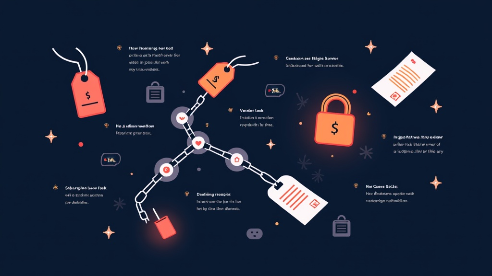

# Hidden Costs of AI SaaS: The Fees You Don't See Coming

In our experience auditing AI SaaS stacks for agent-forge.co, self-hosted AI agents replace $500/month in SaaS tools at $5-20/month operating cost. But the subscription fee is the smallest line item. The real costs — vendor lock-in, price escalation, token overage, tool overlap, and migration risk — compound silently until they dwarf what you actually budgeted. According to Gartner's January 2026 forecast, worldwide AI spending will hit $2.52 trillion this year, up 44% year-over-year (source: gartner.com/en/newsroom/press-releases/2026-1-15). Zylo's 2026 SaaS Management Index found organizations now spend an average of $1.2 million annually on AI-native apps alone — a 108% increase from 2025 (source: zylo.com/blog/ai-cost). If your finance team is budgeting based on per-seat pricing alone, you're already underwater.

## The Subscription Is Just the Entry Fee

AI SaaS pricing in 2026 is a maze of per-seat fees, token overages, and platform add-ons. A 10-person team on ChatGPT Team at $25/seat/month costs $3,600/year on paper. Add Claude Team at $25/seat/month and you're at $7,200. That's the number most teams budget for. It's also the wrong number.

The real costs start where the marketing page ends:

**Token overage.** OpenAI's GPT-5.2 input pricing jumped from $1.25 to $5.75 per million tokens — a 360% increase (source: The Register, theregister.com/software/2026/04/28). Anthropic shifted Claude Enterprise from fixed pricing to dynamic usage-based billing, hitting heavy users with 2-3x cost increases. If your team runs automated pipelines, RAG queries, or agent workflows, your actual API spend can exceed your seat fees by 5-10x.

**Tool overlap.** According to Zylo's 2026 data, the average organization manages 305 SaaS applications. In a typical engineering team, you'll find ChatGPT for drafting, Claude for coding, Copilot for inline completion, a separate AI writing tool, and an AI meeting note taker — all doing overlapping work. The redundancy cost is rarely audited.

**Platform fees on top of API costs.** One Reddit user on r/vibecoding tracked their actual AI dev tool spend: $11.40 in API calls (own keys), $25 platform fee, and $210.60 in overage and add-ons they didn't expect. The "free" trial cost them $247/month (source: reddit.com/r/vibecoding/comments/1rsiuc4).

## Vendor Lock-In Is Worse Than You Think

Here's where the math gets genuinely dangerous. Vendor lock-in with AI tools is worse than traditional SaaS because the switching costs are hidden. A Zapier survey of 542 US executives with active AI contracts found that 90% believed they could switch AI vendors within 4 weeks. Forty-one percent thought it would take just 2-5 business days.

The reality: only 42% of organizations that attempted migration reported it went smoothly. Fifty-eight percent said the process either failed outright or required significantly more effort than expected (source: The Register, Apr 28 2026).

The problem isn't the API. It's everything around it. When AI is woven into internal processes, connected to other systems, and tuned to specific workflows, it accumulates dependencies nobody documented because they were "temporary." Proprietary training data, custom deployment tooling, deep workflow integrations, and institutional knowledge locked in engineers' heads — these are the real switching costs.

One HN commenter put it bluntly: "You are helpless to the constant price increases and each passing renewal you get deeper and deeper into the trap" (source: news.ycombinator.com/item?id=47517539). That's not FUD. That's the structural reality of AI SaaS in 2026.

## The AI Total Cost of Ownership Framework That Actually Works

License cost is only 17-43% of total cost of ownership, according to a 2026 TCO framework by Enersys (source: enersys.co.th/en/insights/tco-total-cost-ownership-software-purchase-framework-2026). The rest is implementation, operations, people, and hidden costs. Here's how to calculate the real AI total cost of ownership:

1. **License/seat fees** — The visible cost. Start here.
2. **Usage overage** — API calls, token overages, compute credits. Track for 90 days.
3. **Integration & implementation** — Engineering hours to connect the tool to your stack. Multiply by fully-loaded engineer cost.
4. **Training & adoption** — Time spent onboarding. Productivity dip during transition.
5. **Operational overhead** — Monitoring, prompt management, output QA, security review.
6. **Switching cost reserve** — Budget 20-30% of annual contract value as an exit reserve. If you can't afford to leave, you're locked in.

An intexsoft.com analysis compared 5-year TCO for a Python-built self-hosted solution ($250,000) versus SaaS ($315,600 projected, assuming 10-15% annual cost increases and growing team) (source: intexsoft.com/blog/total-cost-of-ownership-for-software). The SaaS premium isn't always justified — but you need the full TCO picture to know.

[IMAGE: TCO breakdown diagram showing license fees as 17-43% of total cost, with implementation, operations, people, and hidden costs making up the rest]

## What the Smart Teams Are Doing

The teams that control AI SaaS costs aren't the ones buying the cheapest tools. They're the ones building optionality.

**1. Abstract your AI layer.** Don't hardcode vendor-specific prompts and workflows. Use an abstraction layer (LiteLLM, OpenRouter, or a custom wrapper) so you can swap models without rewriting integrations.

**2. Audit quarterly.** Track actual spend vs. budget every 90 days. Include API overage, platform fees, and the engineering hours spent managing each tool. If a tool's TCO exceeds its value, kill it.

**3. Negotiate exit clauses.** Before signing, negotiate data export rights, API access guarantees, and price caps on renewal increases. If the vendor won't agree, that tells you something.

**4. Evaluate open-source AI SaaS alternatives for high-volume workloads.** Self-hosted LLMs via Ollama (171,000+ GitHub stars, v0.24.0 released May 14, 2026 — source: github.com/ollama/ollama) can replace API costs for internal tools. n8n (187,000+ GitHub stars — source: github.com/n8n-io/n8n) replaces Zapier/Make for workflow automation. Activepieces (21,800+ stars — source: star-history.com/activepieces/activepieces) is the newer alternative gaining fast.

**5. Consolidate ruthlessly.** If three tools do the same job, pick one. The redundancy tax is real and it compounds.

## The Honest Tradeoffs

Self-hosting isn't free. You need hardware, engineering time, and operational expertise. A self-hosted LLM stack on a dedicated server costs $5-20/month in electricity and hardware amortization, but requires 4-8 hours of initial setup and ongoing maintenance. For a team of 10, that's manageable. For a team of 100, the operational overhead can exceed the SaaS savings.

However, vendor lock-in isn't always bad. Deep integration with a single vendor can produce better output quality, faster iteration, and less engineering overhead. The key is knowing you're making that tradeoff intentionally — not stumbling into it because switching seems theoretical until it isn't.

Note that open-source alternatives have real gaps. Ollama doesn't match GPT-5.2's reasoning on complex tasks. n8n's cloud AI features require a paid license. Activepieces' ecosystem is smaller than Zapier's 4,000+ integrations. The cost savings are real, but so is the capability gap for some use cases. The honest answer: most teams should run a hybrid — SaaS for edge cases, self-hosted for high-volume internal workloads.

## Your Action Plan: 5 Steps to Audit Your AI SaaS Spend

1. **Pull 90 days of invoices** — Include API overage, platform fees, and add-ons for every AI tool. Compare total actual spend to what you budgeted. The gap is your hidden cost baseline.

2. **Map tool overlap** — List every AI tool your team uses. Identify which ones do overlapping work (ChatGPT + Claude + Copilot + writing tool + meeting assistant). Pick one per function. Kill the rest.

3. **Calculate switching costs** — For your top 3 AI vendors, estimate what it would take to leave. Include data migration, integration rework, and retraining. If you can't quantify it, that's a risk.

4. **Run a self-hosted pilot** — Deploy Ollama on a spare machine or cheap VPS ($5-20/month). Route one high-volume internal workload through it for 2 weeks. Measure cost vs. API spend.

5. **Document dependencies** — If the person who set up your Claude integration gets hit by a bus, can anyone else maintain it? If not, that's institutional lock-in. Document everything.

The subscription fee is the cover charge. The real bill comes later.

## Frequently Asked Questions

### What are the hidden costs of AI SaaS beyond the subscription fee?

The biggest hidden costs are token/API overage (which can exceed seat fees by 5-10x), tool overlap (most teams run 3-5 AI tools doing similar work), platform fees on top of API costs, and the engineering hours spent on integration and maintenance. According to Enersys's 2026 TCO framework, license fees represent only 17-43% of total cost of ownership. The rest is implementation, operations, people, and costs nobody budgets for.

### How bad is AI vendor lock-in in 2026?

Worse than most executives think. A Zapier survey of 542 US executives found 90% believed they could switch AI vendors within 4 weeks. Reality: 58% of migration attempts failed or required far more effort than expected. The lock-in comes not from APIs but from undocumented workflow integrations, proprietary training data, and institutional knowledge trapped in engineers' heads.

### Can open-source alternatives actually replace AI SaaS tools?

For high-volume internal workloads, yes. Ollama (171k GitHub stars) runs LLMs locally and eliminates API costs. n8n (187k stars) replaces Zapier for workflow automation. Activepieces (21.8k stars) is a fast-growing alternative. The tradeoff is capability gaps on complex tasks and operational overhead for self-hosting. For teams spending $50K+/year on AI APIs, a self-hosted pilot usually pays for itself within 3 months.

### How do I calculate the true TCO of AI tools for my team?

Use the 6-layer framework: (1) license/seat fees, (2) usage overage tracked over 90 days, (3/4) integration and training costs in engineering hours, (5) operational overhead for monitoring and QA, and (6) a switching cost reserve of 20-30% of annual contract value. If the total exceeds the tool's measurable output value, it's time to consolidate or replace.

### Why are AI prices increasing so fast in 2026?

Every AI query has a real compute cost — unlike traditional SDRAM, GPU capacity, and energy are structural expenses that don't decrease with scale the way software marginal costs do. OpenAI's GPT-5.2 input pricing rose 360% ($1.25 to $5.75/M tokens). Anthropic moved Claude Enterprise to usage-based billing. As The Register reported in April 2026, fixed-price tiers are disappearing and token-based pricing is the new baseline. Providers that operated at a loss are now passing infrastructure costs to customers.

### Should I build vs buy AI infrastructure?

It depends on volume and team size. For teams spending under $10K/year on AI APIs, SaaS is almost always cheaper when you factor in engineering time. For teams spending $50K+/year, a self-hosted stack (Ollama + n8n + open-source tools) typically breaks even within 3-6 months. The intexsoft.com TCO analysis found 5-year self-hosted costs at $250K vs $315K for SaaS (assuming 10-15% annual SaaS price increases). The crossover point is usually around 20-30 heavy AI users.

## The Bottom Line

The subscription fee is the smallest line item in your AI budget. Vendor lock-in, price escalation, token overage, tool overlap, and undocumented dependencies are the real costs — and they compound silently. Enterprises that audit these costs quarterly and build abstraction layers to maintain optionality will spend 40-60% less over 3 years than teams that treat AI SaaS like a utility bill. The tools are valuable. The question is whether you're paying for value or paying for inertia.

Start the audit this Monday. The savings start the moment you know what you're actually spending.
