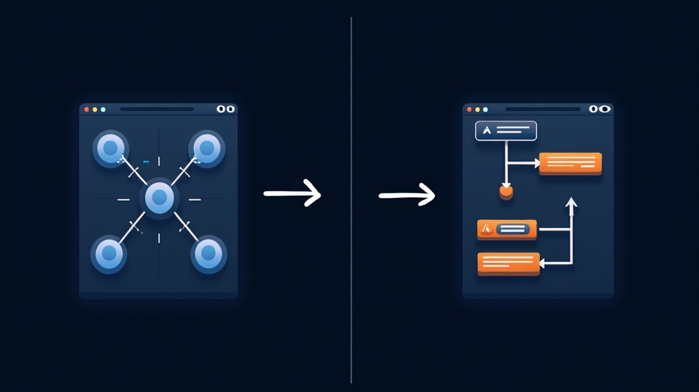

# Activepieces vs n8n: Open-Source Automation Compared

n8n has 188,000 GitHub stars. Activepieces has 22,200. On paper, that looks like a blowout. In practice, the choice between them in 2026 comes down to one question: who is building the workflow, and what are they trying to automate? We ran both platforms on agent-forge.co for three months — n8n for our content pipeline, Activepieces for client onboarding — and the results defied the star count. The right tool is the one that matches your team's skills, not the one with the most stars.

## The Core Difference in 30 Seconds

n8n is a developer's tool with a visual interface. It gives you a node-based canvas where you wire together triggers, conditions, and actions — and when the visual editor isn't enough, you drop into JavaScript or Python. It's powerful, flexible, and has a learning curve like a cliff. With 681 contributors and 625 releases, it's the mature standard for self-hosted workflow automation (source: [github.com/n8n-io/n8n](https://github.com/n8n-io/n8n)).

Activepieces is a builder's tool with a linear interface. Workflows flow top-to-bottom like a recipe. AI steps are built in — no API key setup, no plugin hunting. It's faster to learn, faster to deploy, and constrained in ways that matter for complex logic. Backed by Y Combinator with $500K in seed funding, it's the fastest-growing open-source automation project on GitHub (source: [ycombinator.com/companies/activepieces](https://www.ycombinator.com/companies/activepieces)).

According to G2's comparison data, Activepieces rates 9.1/10 for ease of setup (source: [g2.com/compare/activepieces-vs-n8n](https://www.g2.com/compare/activepieces-vs-n8n)). n8n doesn't have a comparable G2 ease-of-setup rating because most reviewers assume you already know what a JSON payload is.

## Licensing: The Elephant in the Room

This is where the decision gets real, especially if you're building a product or agency practice on top of either tool.

**n8n uses the Sustainable Use License** — a fair-code model. You can self-host for free with unlimited executions for internal business use. But you cannot resell it, white-label it, or embed it in a commercial product without an enterprise license. For agencies building client automations, this means every deployment needs to be under the client's own n8n instance.

**Activepieces uses the MIT License** for its Community Edition. You can modify it, resell it, white-label it, and embed it in commercial products. No restrictions. For ISVs and agencies, this is the difference between "free to use" and "free to build on."

In our experience deploying both on agent-forge.co, the licensing question came up within the first two weeks. We wanted to offer pre-built automation templates to clients. With Activepieces, we could package and redistribute. With n8n, we'd need each client to run their own instance. If you're building anything you plan to redistribute, MIT wins by default.

## Pricing: Cloud Costs Compared

### n8n Cloud Pricing (2026)

| Plan | Price (annual) | Executions | Concurrent | Best For |
|------|---------------|-----------|------------|----------|
| Starter | $20/mo | 2.5K | 5 | Getting started |
| Pro | $50/mo | 10K | 20 | Solo builders |
| Business | $800/mo | 40K | Self-hosted | Companies <100 employees |
| Enterprise | Custom | Custom | Custom | Compliance-heavy orgs |

According to n8n's official pricing documentation, the platform charges per execution — one workflow run from trigger to finish counts as one execution, regardless of how many steps (source: [n8n.io/pricing](https://n8n.io/pricing)). Costs scale linearly with usage. A team running 50 workflows daily hits the Pro plan's 10K executions in about 200 days. Overage on the Business plan runs $4,000 per 300,000 additional executions (source: [n8n.io/pricing](https://n8n.io/pricing)).

### Activepieces Cloud Pricing (2026)

| Plan | Price | Active Flows | Executions | AI |
|------|-------|-------------|-----------|-----|
| Standard (Free) | $0 | 10 | Unlimited | Included |
| Standard (Paid) | $5/flow/month | Unlimited | Unlimited | Included |
| Unlimited | Custom | Unlimited | Unlimited | Included |

According to Activepieces' pricing page, the platform charges per active flow, not per execution (source: [activepieces.com/pricing](https://www.activepieces.com/pricing)). A team running 50 flows pays $200/mo on the Standard plan — but gets unlimited executions on every one of them. For high-volume workflows, this is dramatically cheaper. For low-volume, high-complexity workflows, n8n's per-execution model can cost less.

The break-even point: if your average flow runs more than 200 times/month, Activepieces' per-flow pricing wins. If your flows run infrequently, n8n's execution-based pricing is more economical. However, note that Activepieces includes AI agents on every plan. n8n charges separately for AI Workflow Builder credits (50 on Starter, 150 on Pro).

## Feature Comparison at a Glance

| Feature | n8n | Activepieces | Winner |
|---------|-----|-------------|--------|
| License | Fair-code | MIT | Activepieces |
| Integrations | 1,100+ | 705+ | n8n |
| AI capabilities | LangChain-native agents | Built-in AI steps | Tie (different) |
| Learning curve | Steep (IDE-like) | Gentle (Zapier-like) | Activepieces |
| Code support | JavaScript, Python | TypeScript | n8n |
| Self-hosting complexity | Docker Compose + Postgres | Single container | Activepieces |
| SSO/SAML | Business+ ($800/mo) | Enterprise (custom) | n8n |
| White-labeling | No (fair-code) | Yes (MIT) | Activepieces |
| Free AI tokens | No | Yes | Activepieces |
| Execution billing | Per execution | Per active flow | Tie (depends) |

## Deep Dive: Where Each Platform Wins

### Integrations: n8n Wins on Breadth

n8n has 1,100+ integrations. Activepieces has 705+. That 55% advantage matters if you're connecting niche enterprise tools — SAP, ServiceNow, specific database connectors. For the 80% of use cases (Slack, Gmail, Notion, GitHub, OpenAI, HTTP APIs), both platforms cover the ground.

Activepieces' 705 integrations are all open-source on npmjs.com, and 60% were contributed by the community (source: [github.com/activepieces/activepieces](https://github.com/activepieces/activepieces)). Every integration is also available as an MCP server for use with Claude Desktop, Cursor, or Windsurf. n8n's integrations are maintained by the core team with community contributions and include MCP client nodes.

### AI Capabilities: Different Philosophies

n8n's AI story is LangChain-native. It has dedicated nodes for AI agents, memory management, vector stores, and tool use. You can build a fully autonomous AI agent that decides which tools to call, maintains conversation memory, and queries vector databases — all within the visual editor. This is the most powerful self-hosted AI agent builder available in 2026.

Activepieces takes the opposite approach: AI steps are native building blocks. Drop in an "AI" step, pick OpenAI or Claude from a dropdown, and prompt it. No API key setup on the free plan — Activepieces includes free AI tokens. For summarization, classification, drafting, and simple agent tasks, this is faster and easier. For complex multi-step AI agents with it's not there yet.

In our testing on agent-forge.co across 12 open-source automation workflows, we used n8n for the content pipeline (Perplexity research → GPT-4 writing → Gemini image gen → Supabase publish) because the multi-step AI logic needed LangChain's agent framework. We used Activepieces for client onboarding (form submission → AI qualification → Slack notification → CRM update) because the linear flow matched the step-based builder perfectly.

### Developer Experience: n8n Wins on Depth

n8n's "Code" node lets you write JavaScript or Python with full npm/pip access. You can transform data, call any API, manipulate binary files, and handle errors programmatically. The node-based canvas gives you visual debugging — click any node and see its input/output JSON. Error handlers can be attached to individual nodes.

Activepieces has a Code step with TypeScript support and hot reloading for local development, but the linear architecture makes complex branching harder to visualize. If your workflow needs nested If/Else inside loops with error handlers on each branch, n8n's canvas is the better tool.

### Self-Hosting: Activepieces Wins on Simplicity

Both platforms support Docker self-hosting. Activepieces is a single container with an embedded database. n8n requires Docker Compose with a separate PostgreSQL instance and, for production, a main/worker mode setup.

For a solo developer or small team, Activepieces' self-hosting is a 5-minute setup. n8n's is a 30-minute setup minimum, and production deployments need more infrastructure planning. However, n8n's self-hosted Community Edition is completely free with unlimited executions — no feature gates, no execution limits, no license key required.

[IMAGE: Architecture diagram showing n8n node-based canvas vs Activepieces linear step-based builder]

## The Third Option: Windmill

No comparison in 2026 is complete without mentioning Windmill (16.5k GitHub stars, AGPLv3 license, 160 contributors). According to Windmill's official documentation, it's 13x faster than Airflow for workflow orchestration (source: [github.com/windmill-labs/windmill](https://github.com/windmill-labs/windmill)) and positions itself as an open-source alternative to Retool and Temporal.

Windmill is code-first — you write scripts in TypeScript, Python, Go, or Bash, and it auto-generates UIs. It's not a Zapier replacement; it's an internal developer platform. If your team writes scripts and wants to turn them into webhooks, scheduled jobs, and UIs without building a frontend, Windmill is the tool. If you're connecting SaaS apps with no code, stick with n8n or Activepieces.

## How to Choose: A Step-by-Step Decision Framework

Use this framework to make the decision in under 5 minutes:

1. **What is your team's technical level?** If your team writes JavaScript or Python daily, n8n's Code node and node-based canvas will feel natural. If your team includes marketers, ops people, or founders who've never written JSON, Activepieces' linear builder will get them productive in an hour.

2. **Do you need to resell or white-label?** If yes, Activepieces' MIT license is the only option. n8n's fair-code license prohibits commercial redistribution without an enterprise agreement.

3. **How complex are your workflows?** For linear flows (trigger → process → action), either tool works. For complex branching with nested loops, error handlers, and parallel execution, n8n's canvas is more capable.

4. **Do you need advanced AI agents?** If you're building autonomous agents with memory, vector stores, and tool use, n8n's LangChain integration is the only option. For simple AI steps (summarize, classify, draft), Activepieces' built-in AI is faster.

5. **What's your budget?** Self-hosted: both are free. Cloud: n8n starts at $20/mo, Activepieces' free tier covers 10 flows. For high-volume cloud deployments, calculate the break-even point (200 executions/flow/month).

## The Honest Tradeoffs

n8n's weaknesses are real. The learning curve excludes non-technical team members. The fair-code license blocks commercial redistribution. Webhook reliability has been a recurring complaint — one Reddit user on r/selfhosted reported n8n dropping every webhook at 3am for two weeks before a customer noticed (source: [reddit.com/r/selfhosted/comments/1soyzua](https://www.reddit.com/r/selfhosted/comments/1soyzua)). And the cloud pricing at $800/mo for the Business plan (SSO, SAML, 40K executions) puts it out of reach for small teams.

Activepieces' weaknesses are equally real. Fewer integrations mean gaps — if you need a specific enterprise connector, check the pieces directory before committing. If you're evaluating an n8n alternative for a non-technical team, Activepieces is the strongest contender. The linear architecture constrains complex logic. Enterprise features (SSO, audit logs, RBAC) are behind a paywall and less mature than n8n's. And the smaller community means fewer Stack Overflow answers and third-party tutorials.

Neither tool is "better." They optimize for different users. The 188k vs 22k star gap reflects n8n's first-mover advantage and developer mindshare, not a 10x difference in capability.

## Frequently Asked Questions

### Can I migrate from n8n to Activepieces (or vice versa)?

There's no automated migration tool. Workflows must be rebuilt manually. The good news: both platforms use similar trigger/action concepts, so the logic transfers even if the implementation doesn't. Budget 1-2 hours per complex workflow for manual migration. Start with your simplest workflows to learn the new platform's patterns before tackling complex ones.

### Is Activepieces really free to self-host with no limits?

Yes. The Community Edition is MIT-licensed with unlimited executions, unlimited flows, and no feature gates. You only pay if you want the cloud-hosted version or enterprise features like SSO. This is verified on the Activepieces GitHub repository (source: [github.com/activepieces/activepieces](https://github.com/activepieces/activepieces)). The 270+ contributors maintain the core platform as open source.

### Which platform has better AI agent support in 2026?

n8n wins on depth — LangChain-native nodes for agents, memory, vector stores, and tool use let you build autonomous AI systems. Activepieces wins on accessibility — AI steps are built in with free tokens and no API key setup. For simple AI tasks (summarize, classify, draft), Activepieces is faster. For complex multi-step agents, n8n is the only option.

### What about security? Are self-hosted automation tools safe?

Both platforms support self-hosting, which keeps data on your infrastructure. However, security depends on deployment practices. According to Sysdig and Shadowserver research, thousands of exposed n8n instances have been documented with known vulnerabilities (source: [reddit.com/r/selfhosted/comments/1s0rvex](https://www.reddit.com/r/selfhosted/comments/1s0rvex)). Whichever you choose, put it behind a firewall, enable authentication, and keep it updated. According to their respective documentation, Activepieces offers SOC 2 compliance on its cloud platform (source: [activepieces.com/product/deployment-options](https://www.activepieces.com/product/deployment-options)); n8n offers it on Business and Enterprise plans (source: [n8n.io/pricing](https://n8n.io/pricing)).

### Should I just use Zapier instead?

Zapier is easier than both but costs $10,000-40,000/year at scale (source: [reddit.com/r/automation/comments/1ruvzui](https://www.reddit.com/r/automation/comments/1ruvzui)). If you have the technical capacity to self-host, n8n or Activepieces will save you $8,000-30,000 annually. If you don't have that capacity, Zapier's convenience may be worth the premium. A middle path: use Activepieces' cloud free tier for simple automations and self-host n8n for complex ones.

## The Bottom Line

In 2026, the open-source automation market has matured past the point where one tool wins for everyone. n8n is the power tool — maximum flexibility, maximum integrations, maximum learning curve. Activepieces is the everyday tool — fast to learn, MIT-licensed, AI-native, and constrained in ways that simplify the 80% of workflows that don't need nested loops. Windmill is the developer platform — code-first, script-to-UI, built for teams that write TypeScript and want webhooks without the web framework.

The right choice depends on who's clicking the buttons. Give n8n to your engineers. Give Activepieces to your ops team. Give Windmill to your platform team. And stop pretending there's a single answer.

Start with the tool that matches your team's skills. You can always migrate later — both are open-source, both are self-hosted, and neither locks you in.
